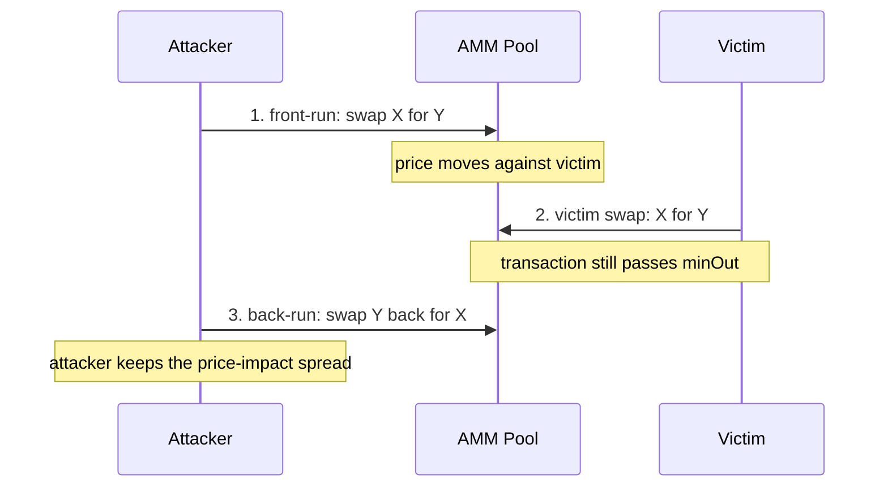
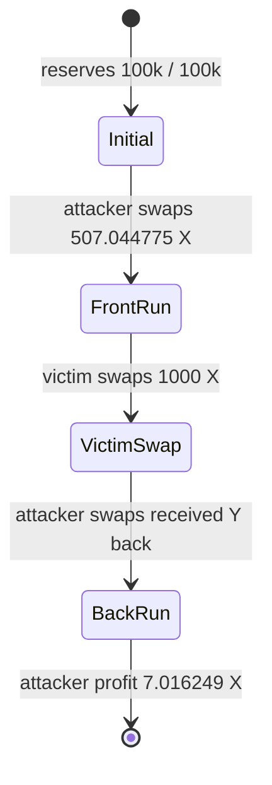
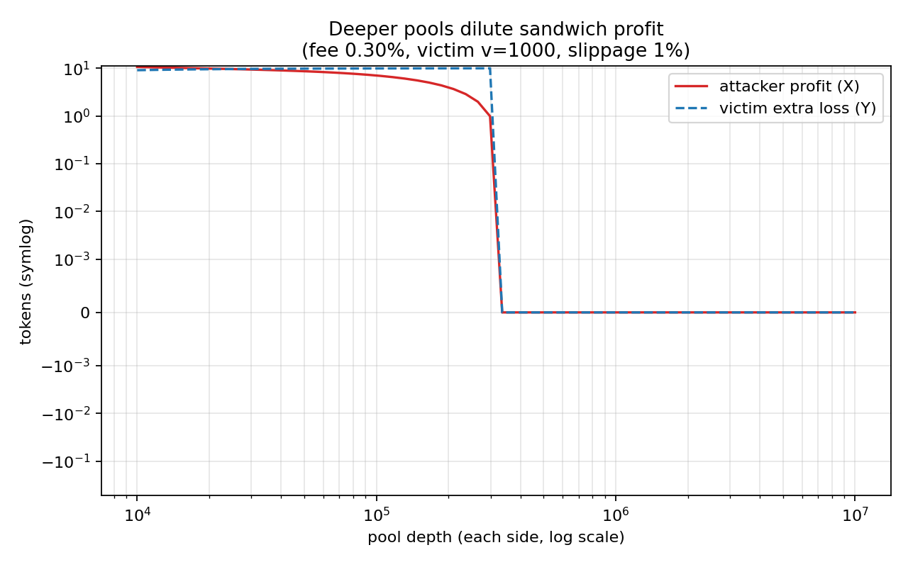
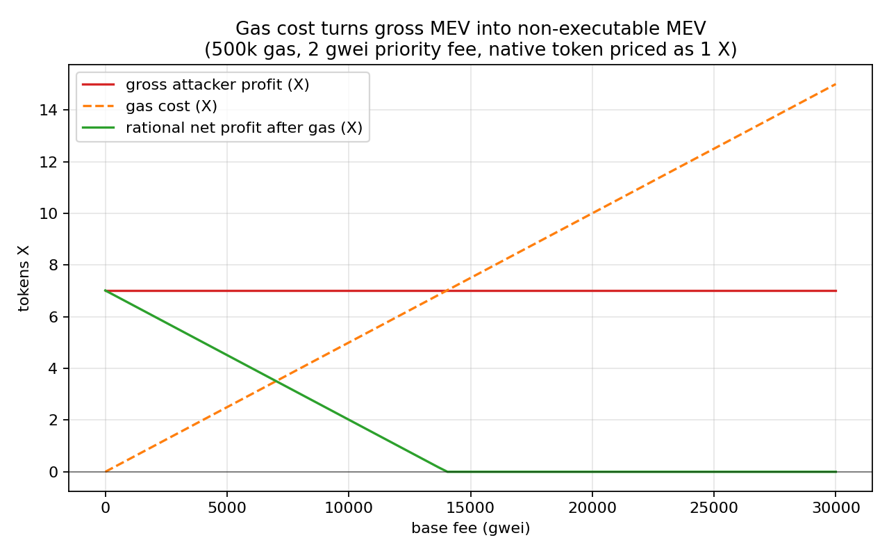

# EVM Sandwich Maximum Extractable Value (MEV) Simulator

[](searcher/)
[](contracts/)
[](#test-coverage)
[](#test-coverage)
[](LICENSE)

Maximum Extractable Value (MEV) is the value that searchers, builders, or
validators can extract by changing transaction ordering, inserting their own
transactions, or reacting to visible pending trades. This repository focuses on
one concrete MEV pattern: the sandwich attack.

The project demonstrates sandwich MEV on Ethereum Virtual Machine
(EVM)-compatible chains, using a Uniswap-V2-style constant-product AMM as the
execution model. It is chain-agnostic for EVM networks rather than wired to one
live deployment; the Solidity validation runs on a local Foundry EVM with mock
tokens and a minimal AMM.

The repo provides three connected layers:

- a Rust simulator that computes and traces the optimal sandwich;
- a Python analysis script that turns parameter sweeps into figures;
- a Foundry project that reproduces the same attack on a local EVM.

It is **not** a production MEV searcher. It does not monitor a real mempool,
send bundles, compete in priority-fee auctions, or execute against mainnet
liquidity. Its purpose is to make the economics and execution path of a
sandwich attack inspectable and reproducible.

## One-Screen Intuition

A sandwich attack needs a visible victim order, a pool whose price moves when
someone trades, and enough victim slippage for the victim transaction to remain
valid after the attacker moves the price.



The AMM uses the constant-product rule:

```text
x * y = k
```

For a swap from token X into token Y, the input increases `x`, the output
decreases `y`, and the pool price `y / x` moves. The victim protects their
trade with:

```text
minOut = honestQuote * (1 - slippageTolerance)
```

The attacker chooses a front-run size that pushes the victim close to `minOut`
without crossing it. If the attacker pushes too hard, the victim transaction
reverts and the sandwich fails.

## Features

| Area | Implemented content | What it provides |
| ---- | ------------------- | ---------------- |
| Rust simulator | CPMM math, victim slippage, fixed-size sandwich simulation, optimal attacker-size search, failure unwind, gas/priority-fee accounting, multi-hop route comparison, bundle/order comparison, CLI commands | Shows the mechanism, optimal trade size, executable profit after gas, and why routing or transaction order changes MEV feasibility. |
| Rust trace | `trace` command prints the ordered pool states | Makes the three-transaction path visible: attacker front-run, victim swap, attacker back-run. |
| Rust sweeps | Victim size, slippage, pool depth, fee, attacker size, gas cost, defense comparison | Produces the data behind the figures and sensitivity analysis. |
| Python plots | Seven PNG figures generated from sweep CSVs | Converts simulation output into visual explanations of profit, loss, gas, liquidity, and defenses. |
| Solidity contracts | `MiniAMM` and `MockERC20` | Provides a minimal EVM version of the same AMM model. |
| Foundry tests | Honest swap test, profitable sandwich cross-check, oversized revert/unwind test | Confirms both successful and failed sandwich outcomes against local EVM execution. |
| Docs and notebook | Mechanism notes, defense discussion, walkthrough, update log, final notebook | Provides written explanations and a reproducible analysis flow. |

Repository layout:

```text
EVM_MEV/
  searcher/     Rust simulator, optimizer, trace command, sweep runner
  contracts/    Foundry project with MiniAMM, mock tokens, tests, scripts
  analysis/     Python plotting script
  data/         Generated CSV sweep outputs
  figures/      Generated PNG figures
  dashboard/    Static browser dashboard for interactive visualization
  docs/         Mechanism notes, defense discussion, walkthrough, updates
```

## Reference Scenario

Reference pool and victim settings:

| Parameter | Value |
| --------- | ----- |
| Pool reserves | `100,000 X / 100,000 Y` |
| AMM fee | `0.30%` |
| Victim swap | `1,000 X -> Y` |
| Victim slippage | `1%` |

The optimized sandwich result is:

| Quantity | Value |
| -------- | ----- |
| Optimal attacker front-run `a` | `507.044775 X` |
| Attacker front-run output | `502.980953 Y` |
| Attacker back-run output | `514.061023 X` |
| Attacker profit | `7.016249 X` |
| Attacker ROI | `1.3838%` |
| Victim honest output | `987.158034 Y` |
| Victim actual output | `977.286454 Y` |
| Victim extra loss | `9.871580 Y` |
| Gas cost | `0 X` by default, configurable in CLI/dashboard |
| Net executable profit | `7.016249 X` before gas costs |

The victim's extra loss is almost exactly the 1% slippage budget. That is the
main lesson: loose slippage creates a feasible profit window, and the rational
attacker pushes to the edge of that window.

## Pool-State Visualization

The `trace` command prints the same sequence as a state table.

```bash
cd searcher
cargo run --release -- trace --victim 1000 --slippage 0.01
```

Expected reference states:

| Step | Actor | Action | Reserve X | Reserve Y | Price `X/Y` | Why it matters |
| ---- | ----- | ------ | --------- | --------- | ----------- | -------------- |
| 0 | - | Initial pool | `100000.000000` | `100000.000000` | `1.000000` | Victim frontend quotes the honest swap here. |
| 1 | Attacker | Front-run X -> Y | `100507.044775` | `99497.019047` | `1.010151` | The attacker moves price against the victim. |
| 2 | Victim | Swap X -> Y | `101507.044775` | `98519.732593` | `1.030322` | Victim receives only `977.286454 Y`, still just above `minOut`. |
| 3 | Attacker | Back-run Y -> X | `100992.983751` | `99022.713546` | `1.019897` | Attacker exits back to X and realizes profit. |



To show that "bigger attack" is not always better, force an oversized
front-run:

```bash
cd searcher
cargo run --release -- simulate --victim 1000 --slippage 0.01 --attacker 2000
```

This demonstrates the revert boundary: once the victim output falls below
`minOut`, the victim does not execute, and the attacker must unwind the failed
front-run.

To show why theoretical MEV is not the same as executable profit, add a gas
model. The output prints both gross profit and net profit:

```bash
cd searcher
cargo run --release -- simulate \
  --victim 1000 \
  --slippage 0.01 \
  --gas-units 500000 \
  --base-fee-gwei 25 \
  --priority-fee-gwei 2 \
  --native-price-x 1
```

Gas cost is modeled as:

```text
gas_cost_x = gas_units * (base_fee_gwei + priority_fee_gwei) * 1e-9 * native_price_x
net_profit_x = gross_profit_x - gas_cost_x
```

The model is intentionally simple: gas is treated as a fixed cost for the
bundle, and `native_price_x` converts the gas token into token X units. When
`--attacker` is omitted, the Rust CLI treats gas as a hurdle and returns
`attacker_in = 0` if the best gross sandwich would be net negative after gas.
When `--attacker` is supplied manually, the CLI prints that fixed attack's net
profit or loss.

## Key Figures

These figures are the main visual evidence for the sandwich MEV mechanism.

### Attacker Size Frontier


This is the most important figure for explaining the attacker's decision. The
profit curve increases as the front-run becomes larger, but only until the
victim output approaches `minOut`. Past that boundary, the victim reverts and
the attacker is left unwinding the failed front-run. The key meaning is that
the optimal attack is not "as large as possible"; it is the largest profitable
trade that still keeps the victim transaction valid.

### Slippage Window


This figure shows why slippage tolerance is central to sandwich MEV. Higher
slippage gives the attacker more room to move the pool price while keeping the
victim transaction executable. The victim's extra loss and the attacker's
profit rise together because both come from the same price-impact window.

### Pool Depth



This figure shows the effect of liquidity. In a deeper pool, the same victim
trade moves the price less, so the attacker has less price impact to harvest.
The key meaning is that large reserves dilute sandwich profitability.

### Gas Cost



This figure separates theoretical MEV from executable profit. Gross sandwich
profit can remain positive while gas and priority fees make net profit zero or
negative. The key meaning is that a profitable-looking opportunity may not be
rational to execute after transaction costs.

## Interactive Dashboard

Open the static dashboard in a browser:

```text
dashboard/index.html
```

If typing `dashboard/index.html` into the browser address bar opens a blank or
missing page, open it from the repository root instead:

```bash
python3 -m http.server 8000
```

Then visit:

```text
http://127.0.0.1:8000/dashboard/
```

The dashboard is an interactive analysis tool, not a separate backend app.
It recomputes the same CPMM sandwich model in JavaScript and shows:

- saved scenario presets for reference, high gas, deep pool, and oversized attack;
- optimal attacker size or a manually selected attacker size;
- gross profit, gas cost, net profit, ROI, victim output, `minOut`, and revert status;
- the attacker-size frontier with the victim `minOut` line;
- the three-step pool state after front-run, victim swap, and back-run;
- the pool price path and step-candle chart with MEV buy/sell markers for explaining price movement. The dashboard price charts use `X/Y`, meaning the price of token `Y` denominated in token `X`, so an attacker `X -> Y` buy pushes the displayed Y price upward. The candle chart is a presentation view: each MEV transaction is one event candle, while background candles and wicks are generated to make the attack visually readable.

Use it with the Rust trace to inspect one parameter at a time, then connect the
curve movement back to slippage and price impact.

## Reproduce The Results

Rust tests and reference trace:

```bash
cd searcher
cargo test --release
cargo run --release -- simulate --victim 1000 --slippage 0.01
cargo run --release -- trace --victim 1000 --slippage 0.01
cargo run --release -- simulate --victim 1000 --slippage 0.01 --gas-units 500000 --base-fee-gwei 25 --priority-fee-gwei 2 --native-price-x 1
```

Generate CSV sweeps:

```bash
cd searcher
cargo run --release -- sweep --out-dir ../data
cargo run --release -- defense --out-dir ../data
```

Run the route and bundle/order scenarios:

```bash
cd searcher
cargo run --release -- route
cargo run --release -- bundle
```

`route` compares the reference direct `X -> Y` pool with a two-hop
`X -> M -> Y` route where the attacker sandwiches the first hop and the victim
checks `minOut` on final `Y` output. `bundle` compares honest execution,
profitable sandwich ordering, oversized front-run with unwind, and victim-first
ordering.

Render figures:

```bash
cd analysis
pip install -r requirements.txt
python plot.py --data ../data --figures ../figures
```

Run the EVM cross-check:

```bash
cd contracts
# First time only, if contracts/lib/forge-std is missing:
# forge install foundry-rs/forge-std
forge test -vv --offline
```

The `--offline` flag avoids Foundry's optional online signature lookup. In this
environment, plain `forge test -vv` can compile successfully and then fail in
Foundry's network/proxy path; the offline command is the stable local version.

## Test Coverage

This repo uses a focused test suite rather than a hosted coverage
percentage. The important behaviors are covered in the two executable layers:

- `searcher/`: Rust unit tests cover CPMM swap math, quote/swap consistency,
  victim revert boundaries, and optimizer behavior.
- `contracts/`: Foundry tests cover honest swaps, profitable sandwiches, and
  oversized front-runs that make the victim revert.

Run the coverage-relevant checks with:

```bash
cd searcher
cargo test --release

cd ../contracts
forge test -vv --offline
```

## Repository Architecture

The repo is organized as a small analysis pipeline: the Rust simulator owns the
reference sandwich model, generated CSVs and figures turn that model into
visual outputs, and the Foundry project cross-checks the same mechanism on a
local EVM.

```text
searcher/  ->  data/  ->  analysis/plot.py  ->  figures/
    |
    +-> dashboard/index.html
    +-> contracts/ Foundry EVM validation
```

| Layer | Main files | Responsibility |
| ----- | ---------- | -------------- |
| Core AMM model | `searcher/src/amm.rs` | Implements Uniswap-V2-style constant-product swap math, fees, quotes, and reserve updates. |
| Sandwich logic | `searcher/src/strategy.rs` | Computes victim `minOut`, simulates front-run/victim/back-run order, detects reverts, and searches for the best attacker size. |
| CLI and experiments | `searcher/src/main.rs`, `searcher/src/experiments.rs`, `searcher/src/report.rs` | Exposes `simulate`, `trace`, `sweep`, `defense`, `route`, and `bundle`; writes CSV outputs for analysis. |
| Analysis outputs | `data/`, `analysis/plot.py`, `figures/` | Stores sweep results and renders the PNG charts. |
| Interactive dashboard | `dashboard/index.html` | Static browser dashboard that recomputes the same CPMM model for live parameter changes. |
| EVM validation | `contracts/src/`, `contracts/test/`, `contracts/script/` | Minimal Solidity AMM/token contracts plus Foundry tests and scripts that reproduce the sandwich scenarios locally. |
| Documentation and notebook | `docs/`, `README.md`, `Final_Lab_Sandwich_MEV_EN.ipynb` | Mechanism notes, defenses, walkthrough material, and reproducible notebook flow. |

## License

This project is released under the MIT License. See `LICENSE` for the full
license text.
