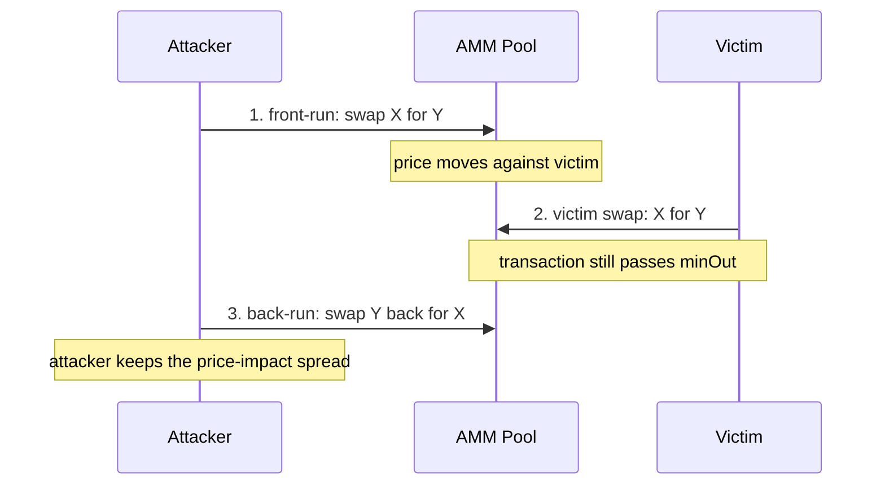
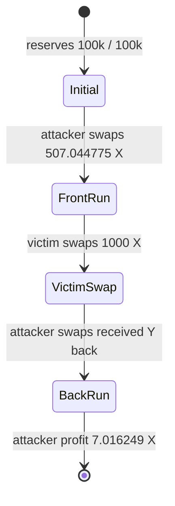

# Sandwich MEV Classroom Demo

This repository is a teaching demo for sandwich MEV on a Uniswap-V2-style
constant-product AMM. It shows the mechanism in three layers:

- a Rust simulator that computes and traces the optimal sandwich;
- a Python analysis script that turns parameter sweeps into figures;
- a Foundry project that reproduces the same attack on a local EVM.

It is **not** a production MEV searcher. It does not monitor a real mempool,
send Flashbots bundles, compete in priority-fee auctions, or execute against
mainnet liquidity. Its purpose is to make the mechanism visible enough for a
30-minute classroom presentation.

## One-Screen Intuition

A sandwich attack needs a visible victim order, a pool whose price moves when
someone trades, and enough victim slippage for the victim transaction to remain
valid after the attacker moves the price.



The AMM uses the constant-product rule:

```text
x * y = k
```

For a swap from token X into token Y, the input increases `x`, the output
decreases `y`, and the pool price `y / x` moves. The victim protects their
trade with:

```text
minOut = honestQuote * (1 - slippageTolerance)
```

The attacker chooses a front-run size that pushes the victim close to `minOut`
without crossing it. If the attacker pushes too hard, the victim transaction
reverts and the sandwich fails.

## What Is Already Implemented

| Area | Implemented content | Demo value |
| ---- | ------------------- | ---------- |
| Rust simulator | CPMM math, victim slippage, fixed-size sandwich simulation, optimal attacker-size search, failure unwind, gas/priority-fee accounting, CLI commands | Shows the mechanism, optimal trade size, and executable profit after gas. |
| Rust trace | `trace` command prints the ordered pool states | Best live demo for explaining the three-transaction sequence. |
| Rust sweeps | Victim size, slippage, pool depth, fee, attacker size, gas cost, defense comparison | Produces the data behind the classroom figures. |
| Python plots | Seven PNG figures generated from sweep CSVs | Converts the attack into visual stories. |
| Solidity contracts | `MiniAMM` and `MockERC20` | Small EVM version of the same AMM. |
| Foundry tests | Honest swap test, profitable sandwich cross-check, oversized revert/unwind test | Confirms both the successful attack and the failed over-sized attack against local EVM execution. |
| Docs | Mechanism notes, defense discussion, classroom walkthrough, update log | Supporting material for a course report or presentation. |

Repository layout:

```text
EVM_MEV/
  searcher/     Rust simulator, optimizer, trace command, sweep runner
  contracts/    Foundry project with MiniAMM, mock tokens, tests, demo scripts
  analysis/     Python plotting script
  data/         Generated CSV sweep outputs
  figures/      Generated PNG figures
  dashboard/    Static browser dashboard for interactive visualization
  docs/         Mechanism notes, defense discussion, walkthrough, updates
```

## Reference Scenario

Reference pool and victim settings:

| Parameter | Value |
| --------- | ----- |
| Pool reserves | `100,000 X / 100,000 Y` |
| AMM fee | `0.30%` |
| Victim swap | `1,000 X -> Y` |
| Victim slippage | `1%` |

The optimized sandwich result is:

| Quantity | Value |
| -------- | ----- |
| Optimal attacker front-run `a` | `507.044775 X` |
| Attacker front-run output | `502.980953 Y` |
| Attacker back-run output | `514.061023 X` |
| Attacker profit | `7.016249 X` |
| Attacker ROI | `1.3838%` |
| Victim honest output | `987.158034 Y` |
| Victim actual output | `977.286454 Y` |
| Victim extra loss | `9.871580 Y` |
| Gas cost | `0 X` by default, configurable in CLI/dashboard |
| Net executable profit | `7.016249 X` before gas costs |

The victim's extra loss is almost exactly the 1% slippage budget. That is the
main lesson: loose slippage creates a feasible profit window, and the rational
attacker pushes to the edge of that window.

## Pool-State Visualization

The `trace` command prints the same sequence as a state table.

```bash
cd searcher
cargo run --release -- trace --victim 1000 --slippage 0.01
```

Expected reference states:

| Step | Actor | Action | Reserve X | Reserve Y | Price `Y/X` | Why it matters |
| ---- | ----- | ------ | --------- | --------- | ----------- | -------------- |
| 0 | - | Initial pool | `100000.000000` | `100000.000000` | `1.000000` | Victim frontend quotes the honest swap here. |
| 1 | Attacker | Front-run X -> Y | `100507.044775` | `99497.019047` | `0.989951` | The attacker moves price against the victim. |
| 2 | Victim | Swap X -> Y | `101507.044775` | `98519.732593` | `0.970570` | Victim receives only `977.286454 Y`, still just above `minOut`. |
| 3 | Attacker | Back-run Y -> X | `100992.983751` | `99022.713546` | `0.980491` | Attacker exits back to X and realizes profit. |



To show that "bigger attack" is not always better, force an oversized
front-run:

```bash
cd searcher
cargo run --release -- simulate --victim 1000 --slippage 0.01 --attacker 2000
```

This demonstrates the revert boundary: once the victim output falls below
`minOut`, the victim does not execute, and the attacker must unwind the failed
front-run.

To show why theoretical MEV is not the same as executable profit, add a gas
model. The output prints both gross profit and net profit:

```bash
cd searcher
cargo run --release -- simulate \
  --victim 1000 \
  --slippage 0.01 \
  --gas-units 500000 \
  --base-fee-gwei 25 \
  --priority-fee-gwei 2 \
  --native-price-x 1
```

Gas cost is modeled as:

```text
gas_cost_x = gas_units * (base_fee_gwei + priority_fee_gwei) * 1e-9 * native_price_x
net_profit_x = gross_profit_x - gas_cost_x
```

The model is intentionally simple: gas is treated as a fixed cost for the
bundle, and `native_price_x` converts the gas token into token X units. When
`--attacker` is omitted, the Rust CLI treats gas as a hurdle and returns
`attacker_in = 0` if the best gross sandwich would be net negative after gas.
When `--attacker` is supplied manually, the CLI prints that fixed attack's net
profit or loss.

## Figures To Show In Class

The figures are generated outputs, not hand-drawn slides. If the `figures/`
directory is missing, regenerate it with the commands in the next section.

| Figure | What to point at | Classroom takeaway |
| ------ | ---------------- | ------------------ |
| `figures/fig_attacker_size.png` | Profit curve peaks just before victim output crosses `minOut` | The attacker is constrained by slippage; the optimum is near the revert boundary. |
| `figures/fig_slippage.png` | Profit and victim extra loss rise as slippage rises | Slippage is not only a UX setting; it is the attacker's feasible window. |
| `figures/fig_pool_depth.png` | Profit shrinks in deeper pools | Larger reserves dilute price impact. |
| `figures/fig_fee.png` | Profit collapses when fee becomes high enough | The attacker pays fees twice, on front-run and back-run. |
| `figures/fig_victim_size.png` | Bigger victim trades create larger opportunities | Large visible swaps are more attractive targets. |
| `figures/fig_gas.png` | Gross profit can stay positive while net profit disappears | Gas and priority fees decide whether theoretical MEV is executable. |
| `figures/fig_defense.png` | Mitigations compared side by side | Lower slippage, deeper pools, higher fees, gas costs, and private routing shrink or remove the attack window. |

The two figures below are the best ones to put directly on screen during the
main explanation.


## Interactive Dashboard

Open the static dashboard in a browser:

```text
dashboard/index.html
```

It has no backend and no dependency install step. It recomputes the same CPMM
sandwich model in JavaScript and shows:

- saved scenario presets for reference, high gas, deep pool, and oversized attack;
- optimal attacker size or a manually selected attacker size;
- gross profit, gas cost, net profit, ROI, victim output, `minOut`, and revert status;
- the attacker-size frontier with the victim `minOut` line;
- the three-step pool state after front-run, victim swap, and back-run.

Use it after the Rust trace when the audience understands the basic sequence:
move one parameter at a time, then connect the curve movement back to the
slippage and price-impact story.

Recommended live-demo setup:

1. Keep this README open for the diagrams and speaking script.
2. Keep a terminal open in `searcher/` for `trace`, `simulate`, and `sweep`.
3. Keep `dashboard/index.html` open in a browser for parameter Q&A.
4. Keep a second terminal open in `contracts/` for `forge test -vv --offline`.

During Q&A, use the dashboard in this order:

1. Click "Reference" and connect the dashboard values to the Rust trace.
2. Click "High gas" and show gross profit versus net profit.
3. Click "Deep pool" and point out that the same victim trade moves price less.
4. Click "Oversized" and show victim revert plus attacker unwind loss.
5. Manually increase slippage and point out that the feasible attacker window expands.
6. Increase the fee and point out that the attacker pays fees on both legs.
7. Disable "Use optimal attacker size", drag attacker size too far, and show the
   victim revert status.

## Reproduce The Demo

Rust tests and reference trace:

```bash
cd searcher
cargo test --release
cargo run --release -- simulate --victim 1000 --slippage 0.01
cargo run --release -- trace --victim 1000 --slippage 0.01
cargo run --release -- simulate --victim 1000 --slippage 0.01 --gas-units 500000 --base-fee-gwei 25 --priority-fee-gwei 2 --native-price-x 1
```

Generate CSV sweeps:

```bash
cd searcher
cargo run --release -- sweep --out-dir ../data
cargo run --release -- defense --out-dir ../data
```

Render figures:

```bash
cd analysis
pip install -r requirements.txt
python plot.py --data ../data --figures ../figures
```

Run the EVM cross-check:

```bash
cd contracts
# First time only, if contracts/lib/forge-std is missing:
# forge install foundry-rs/forge-std
forge test -vv --offline
```

The `--offline` flag avoids Foundry's optional online signature lookup. In this
environment, plain `forge test -vv` can compile successfully and then fail in
Foundry's network/proxy path; the offline command is the stable classroom
version.

## 30-Minute Presentation Script

| Time | Topic | What to show |
| ---- | ----- | ------------ |
| 0-3 min | MEV and sandwich background | Start from the sequence diagram: attacker front-runs, victim executes at worse price, attacker back-runs. |
| 3-8 min | CPMM and slippage | Explain `x * y = k`, price `y / x`, honest quote, and `minOut`. |
| 8-15 min | Live trace | Run `cargo run --release -- trace --victim 1000 --slippage 0.01`; walk row by row through the reserve table. |
| 15-20 min | Success vs failure | Run the oversized attacker example; then show `fig_attacker_size.png`. |
| 20-24 min | Parameter sweeps | Show slippage, pool depth, fee, and victim-size figures in that order. |
| 24-27 min | EVM validation | Run `forge test -vv --offline`; point out that Solidity integer math matches Rust within 1%. |
| 27-30 min | Defenses and extensions | Tie every defense to a broken assumption: visible order, high price impact, low round-trip cost, or strict ordering. |

## Next Features Worth Building

| Status | Feature | Notes |
| ------ | ------- | ----- |
| Done | Keep README, Rust reference output, and dashboard defaults aligned | Reference scenario remains `100k/100k`, `0.30%` fee, `1000 X` victim, `1%` slippage; README, Rust CLI, Foundry logs, and dashboard match the same headline values. |
| Done | Add a Foundry oversized-front-run revert/unwind test | `test_oversized_frontrun_reverts_and_unwinds_at_loss` verifies the `2000 X` front-run makes the victim revert and forces attacker unwind at a loss. |
| Done | Add gas and priority-fee parameters to Rust | `simulate` and `trace` support `--gas-units`, `--base-fee-gwei`, `--priority-fee-gwei`, and `--native-price-x`; output includes gas cost, net profit, and net ROI. |
| Done | Add gas-aware dashboard controls | The dashboard shows gross profit, gas cost, and net profit while keeping the same reference scenario defaults. |
| Done | Add gas-aware sweep plots | `sweep` writes `sweep_gas.csv`, and `analysis/plot.py` renders `fig_gas.png` to show where net profit disappears after gas. |
| Done | Add a defense-focused sweep command | `cargo run --release -- defense --out-dir ../data` writes `defense_comparison.csv`; full `sweep` also writes it. |
| Done | Expand the dashboard with saved scenarios | Preset buttons switch between reference, high gas, deep pool, and oversized attacker cases. |
| Not yet | Add multi-pool or multi-hop routing | Move beyond one CPMM pool to a more realistic DEX routing setup. |
| Not yet | Add a mempool ordering / bundle simulator | Make the gap between local transaction sequencing and production MEV explicit. |
