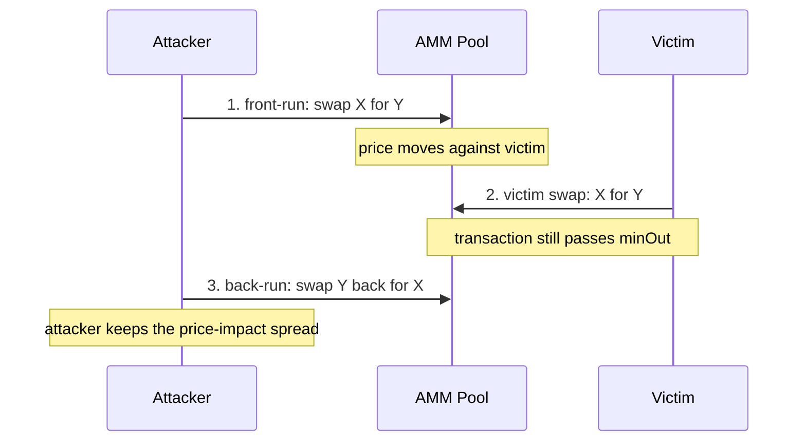
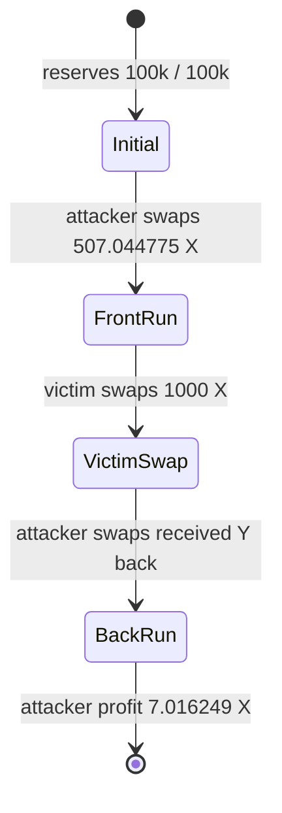
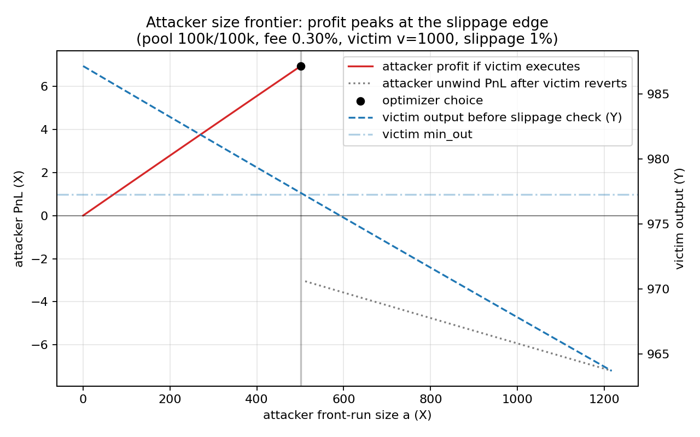
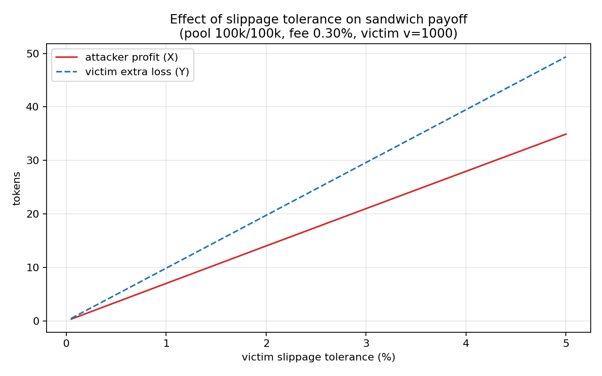

# Sandwich MEV Classroom Demo

This repository is a teaching demo for sandwich MEV on a Uniswap-V2-style
constant-product AMM. It shows the mechanism in three layers:

- a Rust simulator that computes and traces the optimal sandwich;
- a Python analysis script that turns parameter sweeps into figures;
- a Foundry project that reproduces the same attack on a local EVM.

It is **not** a production MEV searcher. It does not monitor a real mempool,
send Flashbots bundles, compete in priority-fee auctions, or execute against
mainnet liquidity. Its purpose is to make the mechanism visible enough for a
30-minute classroom presentation.

## One-Screen Intuition

A sandwich attack needs a visible victim order, a pool whose price moves when
someone trades, and enough victim slippage for the victim transaction to remain
valid after the attacker moves the price.



The AMM uses the constant-product rule:

```text
x * y = k
```

For a swap from token X into token Y, the input increases `x`, the output
decreases `y`, and the pool price `y / x` moves. The victim protects their
trade with:

```text
minOut = honestQuote * (1 - slippageTolerance)
```

The attacker chooses a front-run size that pushes the victim close to `minOut`
without crossing it. If the attacker pushes too hard, the victim transaction
reverts and the sandwich fails.

## What Is Already Implemented

| Area | Implemented content | Demo value |
| ---- | ------------------- | ---------- |
| Rust simulator | CPMM math, victim slippage, fixed-size sandwich simulation, optimal attacker-size search, failure unwind, CLI commands | Shows the mechanism and the optimal trade size numerically. |
| Rust trace | `trace` command prints the ordered pool states | Best live demo for explaining the three-transaction sequence. |
| Rust sweeps | Victim size, slippage, pool depth, fee, attacker size | Produces the data behind the classroom figures. |
| Python plots | Five PNG figures generated from sweep CSVs | Converts the attack into visual stories. |
| Solidity contracts | `MiniAMM` and `MockERC20` | Small EVM version of the same AMM. |
| Foundry tests | Honest swap test and sandwich profit cross-check | Confirms the Rust result against local EVM execution. |
| Docs | Mechanism notes, defense discussion, classroom walkthrough, update log | Supporting material for a course report or presentation. |

Repository layout:

```text
EVM_MEV/
  searcher/     Rust simulator, optimizer, trace command, sweep runner
  contracts/    Foundry project with MiniAMM, mock tokens, tests, demo scripts
  analysis/     Python plotting script
  data/         Generated CSV sweep outputs
  figures/      Generated PNG figures
  dashboard/    Static browser dashboard for interactive visualization
  docs/         Mechanism notes, defense discussion, walkthrough, updates
```

## Reference Scenario

Reference pool and victim settings:

| Parameter | Value |
| --------- | ----- |
| Pool reserves | `100,000 X / 100,000 Y` |
| AMM fee | `0.30%` |
| Victim swap | `1,000 X -> Y` |
| Victim slippage | `1%` |

The optimized sandwich result is:

| Quantity | Value |
| -------- | ----- |
| Optimal attacker front-run `a` | `507.044775 X` |
| Attacker front-run output | `502.980953 Y` |
| Attacker back-run output | `514.061023 X` |
| Attacker profit | `7.016249 X` |
| Attacker ROI | `1.3838%` |
| Victim honest output | `987.158034 Y` |
| Victim actual output | `977.286454 Y` |
| Victim extra loss | `9.871580 Y` |

The victim's extra loss is almost exactly the 1% slippage budget. That is the
main lesson: loose slippage creates a feasible profit window, and the rational
attacker pushes to the edge of that window.

## Pool-State Visualization

The `trace` command prints the same sequence as a state table.

```bash
cd searcher
cargo run --release -- trace --victim 1000 --slippage 0.01
```

Expected reference states:

| Step | Actor | Action | Reserve X | Reserve Y | Price `Y/X` | Why it matters |
| ---- | ----- | ------ | --------- | --------- | ----------- | -------------- |
| 0 | - | Initial pool | `100000.000000` | `100000.000000` | `1.000000` | Victim frontend quotes the honest swap here. |
| 1 | Attacker | Front-run X -> Y | `100507.044775` | `99497.019047` | `0.989951` | The attacker moves price against the victim. |
| 2 | Victim | Swap X -> Y | `101507.044775` | `98519.732593` | `0.970570` | Victim receives only `977.286454 Y`, still just above `minOut`. |
| 3 | Attacker | Back-run Y -> X | `100992.983751` | `99022.713546` | `0.980491` | Attacker exits back to X and realizes profit. |



To show that "bigger attack" is not always better, force an oversized
front-run:

```bash
cd searcher
cargo run --release -- simulate --victim 1000 --slippage 0.01 --attacker 2000
```

This demonstrates the revert boundary: once the victim output falls below
`minOut`, the victim does not execute, and the attacker must unwind the failed
front-run.

## Figures To Show In Class

The figures are generated outputs, not hand-drawn slides. If the `figures/`
directory is missing, regenerate it with the commands in the next section.

| Figure | What to point at | Classroom takeaway |
| ------ | ---------------- | ------------------ |
| `figures/fig_attacker_size.png` | Profit curve peaks just before victim output crosses `minOut` | The attacker is constrained by slippage; the optimum is near the revert boundary. |
| `figures/fig_slippage.png` | Profit and victim extra loss rise as slippage rises | Slippage is not only a UX setting; it is the attacker's feasible window. |
| `figures/fig_pool_depth.png` | Profit shrinks in deeper pools | Larger reserves dilute price impact. |
| `figures/fig_fee.png` | Profit collapses when fee becomes high enough | The attacker pays fees twice, on front-run and back-run. |
| `figures/fig_victim_size.png` | Bigger victim trades create larger opportunities | Large visible swaps are more attractive targets. |

The two figures below are the best ones to put directly on screen during the
main explanation.





## Interactive Dashboard

Open the static dashboard in a browser:

```text
dashboard/index.html
```

It has no backend and no dependency install step. It recomputes the same CPMM
sandwich model in JavaScript and shows:

- optimal attacker size or a manually selected attacker size;
- attacker profit, ROI, victim output, `minOut`, and revert status;
- the attacker-size frontier with the victim `minOut` line;
- the three-step pool state after front-run, victim swap, and back-run.

Use it after the Rust trace when the audience understands the basic sequence:
move one parameter at a time, then connect the curve movement back to the
slippage and price-impact story.

Recommended live-demo setup:

1. Keep this README open for the diagrams and speaking script.
2. Keep a terminal open in `searcher/` for `trace`, `simulate`, and `sweep`.
3. Keep `dashboard/index.html` open in a browser for parameter Q&A.
4. Keep a second terminal open in `contracts/` for `forge test -vv --offline`.

During Q&A, use the dashboard in this order:

1. Increase slippage and point out that the feasible attacker window expands.
2. Increase pool depth and point out that the same victim trade moves price less.
3. Increase the fee and point out that the attacker pays fees on both legs.
4. Disable "Use optimal attacker size", drag attacker size too far, and show the
   victim revert status.

## Reproduce The Demo

Rust tests and reference trace:

```bash
cd searcher
cargo test --release
cargo run --release -- simulate --victim 1000 --slippage 0.01
cargo run --release -- trace --victim 1000 --slippage 0.01
```

Generate CSV sweeps:

```bash
cd searcher
cargo run --release -- sweep --out-dir ../data
```

Render figures:

```bash
cd analysis
pip install -r requirements.txt
python plot.py --data ../data --figures ../figures
```

Run the EVM cross-check:

```bash
cd contracts
# First time only, if contracts/lib/forge-std is missing:
# forge install foundry-rs/forge-std
forge test -vv --offline
```

The `--offline` flag avoids Foundry's optional online signature lookup. In this
environment, plain `forge test -vv` can compile successfully and then fail in
Foundry's network/proxy path; the offline command is the stable classroom
version.

## 30-Minute Presentation Script

| Time | Topic | What to show |
| ---- | ----- | ------------ |
| 0-3 min | MEV and sandwich background | Start from the sequence diagram: attacker front-runs, victim executes at worse price, attacker back-runs. |
| 3-8 min | CPMM and slippage | Explain `x * y = k`, price `y / x`, honest quote, and `minOut`. |
| 8-15 min | Live trace | Run `cargo run --release -- trace --victim 1000 --slippage 0.01`; walk row by row through the reserve table. |
| 15-20 min | Success vs failure | Run the oversized attacker example; then show `fig_attacker_size.png`. |
| 20-24 min | Parameter sweeps | Show slippage, pool depth, fee, and victim-size figures in that order. |
| 24-27 min | EVM validation | Run `forge test -vv --offline`; point out that Solidity integer math matches Rust within 1%. |
| 27-30 min | Defenses and extensions | Tie every defense to a broken assumption: visible order, high price impact, low round-trip cost, or strict ordering. |

## Can This Run On A Testnet?

Yes, but it should be framed carefully.

The primary classroom demo is local: Rust plus Foundry gives deterministic
output and does not depend on public RPC latency, faucet balance, or block
ordering. A Sepolia version can still demonstrate the mechanism by deploying
this repo's own `MockERC20` tokens and `MiniAMM`, adding toy liquidity, then
sending the three transactions in order.

What a testnet demo proves:

- the contracts can be deployed to a public EVM network;
- the AMM, slippage check, and sandwich transaction sequence work on-chain;
- transaction ordering affects the victim's execution price.

What it does **not** prove:

- real mainnet MEV profitability;
- public mempool searcher competition;
- block builder behavior or bundle inclusion;
- extraction from real user orderflow.

Use only test wallets and test ETH. Never put a real private key or real funds
into the demo environment.

Optional script flow:

```bash
cd contracts
cp .env.example .env
# Fill SEPOLIA_RPC_URL and test private keys.
set -a; source .env; set +a

# Local dry run first. In another terminal, start Anvil:
anvil --host 127.0.0.1 --port 8545

# Then deploy against the local chain:
forge script script/DeployDemo.s.sol:DeployDemo --rpc-url http://127.0.0.1:8545 --broadcast

# Sepolia deployment:
forge script script/DeployDemo.s.sol:DeployDemo --rpc-url "$SEPOLIA_RPC_URL" --broadcast

# After setting TOKEN_X, TOKEN_Y, and AMM_ADDRESS from deployment output:
forge script script/RunSandwichDemo.s.sol:RunSandwichDemo --rpc-url "$SEPOLIA_RPC_URL" --broadcast
```

## Supporting Docs

- [`docs/mechanism.md`](docs/mechanism.md): formula-level derivation of the
  CPMM sandwich payoff and optimizer.
- [`docs/defense.md`](docs/defense.md): mitigation discussion for users and
  protocol designers.
- [`docs/lab_walkthrough.md`](docs/lab_walkthrough.md): earlier classroom
  walkthrough organized as a live lab.
- [`docs/update_2026-04-29.md`](docs/update_2026-04-29.md): update log for
  trace, attacker-size sweep, revert handling, and Foundry logs.

## Next Features Worth Building

| Priority | Feature | Why it helps |
| -------- | ------- | ------------ |
| P0 | Keep README and dashboard aligned with the reference scenario | Makes the 30-minute presentation reproducible. |
| P1 | Add a Foundry oversized-front-run revert/unwind test | Mirrors the Rust failure demo on EVM. |
| P2 | Add gas and priority-fee parameters to Rust | Separates theoretical profit from executable profit. |
| P3 | Add a defense-focused sweep command | Gives one-click comparisons for slippage, fee, and liquidity defenses. |
| P4 | Expand the dashboard with saved scenarios | Makes classroom Q&A easier when students ask "what if?" questions. |
| P5 | Add multi-pool or multi-hop routing | Moves the toy model closer to realistic DEX routing. |

## Scope Notes

This demo intentionally stays small. It models one public AMM pool, one victim
swap, and one attacker who can force the three-transaction order. That scope is
enough to explain the core MEV mechanism while keeping the math, code, and
presentation readable.
